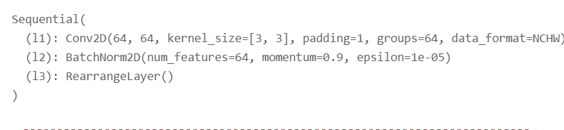
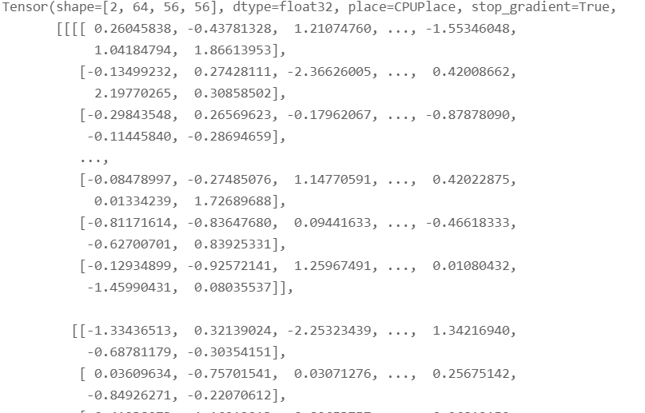

## 报错: NotImplementedError
### 位置
```python
q = self.conv_proj_q(x)
```
### 其中打印`conv_proj_q`

### 打印`x`


### proj_q源码
```python
proj = nn.Sequential(
                (nn.Conv2D(
                    dim_in,
                    dim_in,
                    kernel_size=kernel_size,
                    padding=padding,
                    stride=stride,
                    bias_attr=False,
                    groups=dim_in
                )),
                (nn.BatchNorm2D(dim_in)),
                (RearrangeLayer('b c h w -> b (h w) c')),
            )


'''RearrangeLayer类的定义
`rearrange:func` 和 `Rearrange:nn.Layer` 是基于MIT的开源库enipos的函数，但是不支持`paddle.Tonsor`类型的输入。

目前我的解决办法是采用`PaddleRearrange`和`RearrangeLayer`进行包装，先转化为`np.array`作为`rearrange`的输入，最后将输出转化回来。

更好的解决办法是`fork`enipos，并修改代码使得支持paddle.Tensor 网址： https://github.com/arogozhnikov/einops
'''


def PaddleRearrange(tensor: paddle.Tensor, pattern: str, **axes_lengths) -> paddle.Tensor:
    x = np.array(tensor)
    return paddle.to_tensor(rearrange(x, pattern, **axes_lengths))


class RearrangeLayer(nn.Layer):
    def __init__(self, pattern):
        super().__init__()
        self.pattern = pattern

    def forword(self, x: paddle.Tensor):
        return PaddleRearrange(x, self.pattern)


```

我的思考:
我怀疑是不是`RearrangeLayer`写的不对，但是也看不出来实际问题在哪。